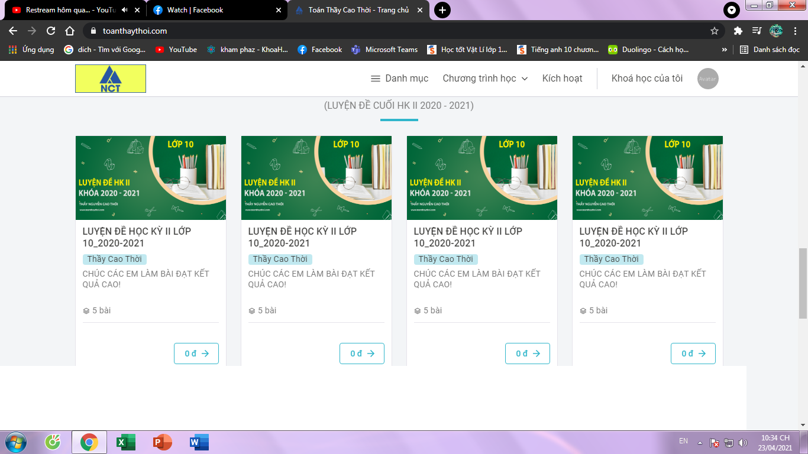

<!DOCTYPE html>
<html leng="en">
  <head> 
    <title>The picture</title>
  </head>
  <body>
    <h1>This is a picture</h1>
    
    <ol>
      <li>The first</li>
      <li>The second</li>
      <li>The third</li>
    </ol>
    <ul>
      <li>One</li>
      <li>Two</li>
      <li>Three</li>
    </ul>
  </body>
  </html>
